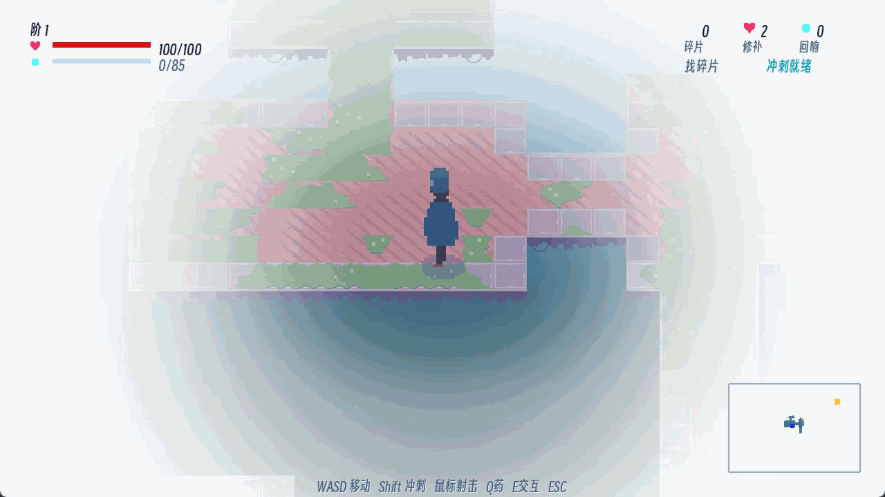
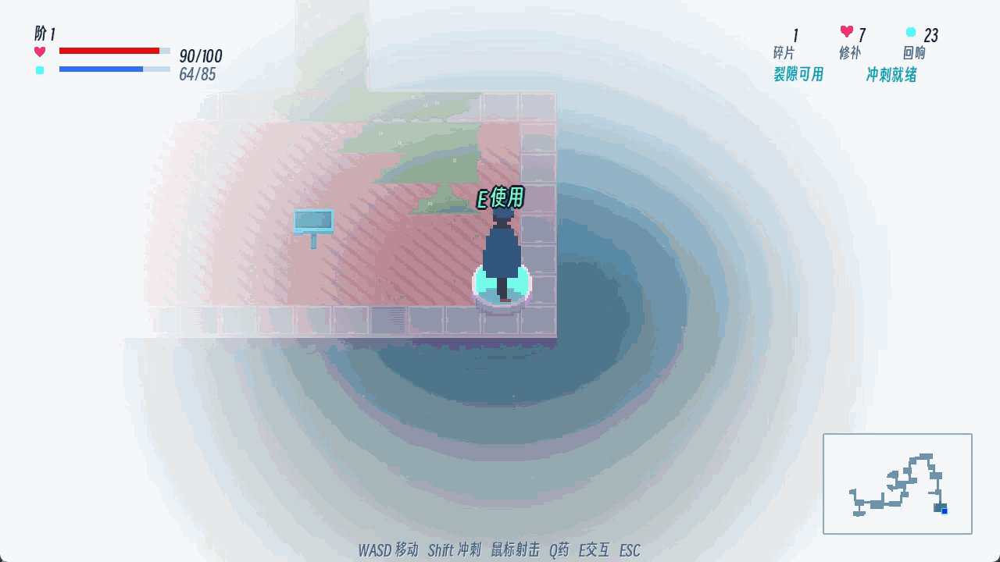
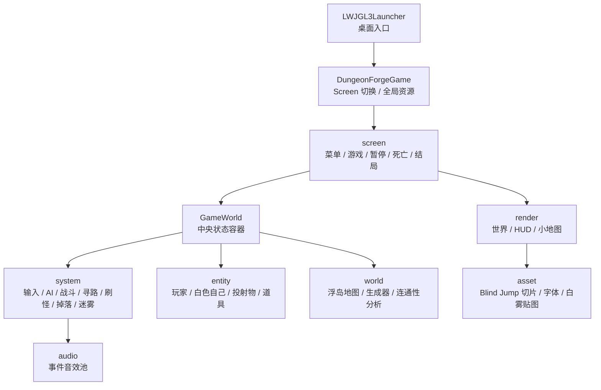
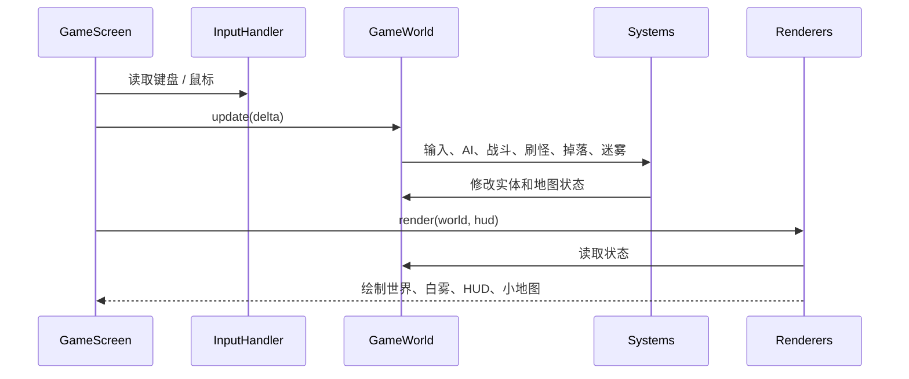

# Sky Spy（空谍）

<p align="center">
  
</p>

<p align="center">
  
  
  
  
</p>

<p align="center">
  <strong>在白雾浮岛上，用眼部投射击落被漂白的“自己”，收集记忆碎片，逼近顶层真相。</strong>
</p>

`Sky Spy（空谍）` 是一个基于 **Java 17 + libGDX** 的 2D 实时动作 Roguelite。玩家在白雾浮岛中探索、射击、冲刺、击退敌人，并通过“记忆裂隙”向更高层推进。

Sky Spy 通过白雾浮岛、眼部投射、边缘坠落和记忆裂隙，把“记忆被漂白”的叙事转化为可玩的 2D Roguelite 机制。

---

## 目录

- [项目亮点](#项目亮点)
- [玩法与剧情如何绑定](#玩法与剧情如何绑定)
- [Demo 展示](#demo-展示)
- [功能模块](#功能模块)
- [技术栈与选型](#技术栈与选型)
- [关键算法](#关键算法)
- [工程结构](#工程结构)
- [实现成果与验证](#实现成果与验证)
- [视觉与 UI](#视觉与-ui)
- [运行与验证](#运行与验证)
- [操作方式](#操作方式)
- [项目讲解路线](#项目讲解路线)
- [FAQ](#faq)
- [局限与后续工作](#局限与后续工作)
- [文档索引](#文档索引)
- [资源与许可证](#资源与许可证)

---

## 项目亮点

| 亮点 | 项目价值 |
|---|---|
| 白雾浮岛替代旧式地牢 | 场景不是封闭房间，而是可坠落的随机浮岛，视觉和玩法都贴合“空白记忆”设定。 |
| 边缘坠落变成战斗策略 | 击退不是普通数值反馈，玩家可以主动把敌人打下平台。 |
| 随机生成仍可验证 | 使用 seed、连通性分析和合同测试，避免随机地图出现不可通关孤岛。 |
| 敌人与叙事统一 | 除白猫外，敌人与主角共用素材，通过白色遮罩、行为和层级变化表达“白色自己”。 |
| 工程结构清晰 | `GameWorld` 保存状态，`system` 修改状态，`render` 只读取状态并绘制。 |

一句话概括：

> **Sky Spy 把“记忆被漂白”的剧情，做成了白雾视野、白色敌人、浮岛坠落和向上推进的游戏机制。**

剧情完整设定见 [SKY_SPY_STORY_PLAN.md](SKY_SPY_STORY_PLAN.md)，当前实现符合度见 [SKY_SPY_COMPLIANCE_AUDIT.md](SKY_SPY_COMPLIANCE_AUDIT.md)。

---

## 玩法与剧情如何绑定

| 剧情设定 | 对应机制 | 设计作用 |
|---|---|---|
| 记忆正在被漂白 | 白雾遮挡远处区域，视野外敌人信息隐藏 | 白雾不是普通黑暗迷雾，而是“空白记忆”的视觉化。 |
| 敌人是被漂白的自己 | 敌人与主角共用人形素材，只用白色遮罩、透明度和行为区分 | 敌人不是外部怪物，而是自我防御机制。 |
| 主角不断向上寻找真相 | 收集记忆碎片后，通过记忆裂隙进入下一层 | 每一层推进都对应更接近顶层真相。 |
| 浮岛边缘代表记忆断裂 | 玩家和敌人离开可行走区域会坠落死亡 | 地图边界不是装饰，而是战斗系统的一部分。 |
| 白猫是独立记忆锚点 | 白猫使用独立素材，和普通白色自己区分 | 让剧情中重要记忆有稳定的视觉识别。 |

主角醒在白雾浮岛，周围出现很多与自己相似的白色人形。它们阻止主角上升。玩家后期会发现：这些敌人不是外部怪物，而是被漂白的自我片段。最终目标不是“杀光怪物”，而是穿过自我防御，重新看见完整的自己。

---

## Demo 展示

下面的动图展示 Sky Spy 的核心玩法循环：探索白雾浮岛、用眼部投射击退白色自己、收集记忆碎片，并通过记忆裂隙向更高层推进。

| 展示内容 | 说明 | 动图 |
|---|---|---|
| 完整流程 | 展示探索、战斗、收集、进入裂隙的完整循环。 |  |
| 击落敌人 | 展示击退如何把敌人推下平台，使边缘坠落成为战斗策略。 |  |
| 白雾视野 | 展示远处区域被白雾吞没，视野外敌人信息隐藏。 |  |
| 虚空坠落 | 展示玩家或敌人离开浮岛边缘后的坠落死亡。 |  |
| 眼部投射 | 展示鼠标方向控制眼部投射。 |  |
| 记忆裂隙 | 展示收集记忆碎片后进入下一层。 |  |

---

## 功能模块

### 1. 白雾浮岛

每层地图由多个悬空平台和连接桥组成。地图不是固定关卡，而是每次生成不同结构。

关键体验：

- 平台边缘不是装饰，玩家和敌人离开可行走区域都会坠落。
- 通道宽度至少 2 格，减少卡死和误判。
- 关键节点包括出生点、记忆碎片、情绪匣和记忆裂隙。
- 小地图显示已探索区域和关键元素。

### 2. 眼部投射与击退

当前版本不绘制独立武器精灵，攻击表现为从角色眼部发出的投射物。

规则：

- 鼠标左键或右键射击。
- 射击方向由鼠标世界坐标决定。
- 投射物带击退。
- 敌人被击退到平台外会坠落死亡。
- 发射投射物不会强行打断移动动画。

### 3. 白色自己与白猫

敌人不是传统怪物，而是被漂白的自我片段。

- 除白猫外，敌人与主角共用同一套人形素材。
- 差异由白色 tint、透明度、行为、预警和层级变化体现。
- 越往上，敌人的白色遮罩越弱，越接近“我”。
- 白猫使用 Blind Jump 的 Laika 猫帧，是独立记忆锚点。

### 4. Roguelite 循环

单局流程：

1. 进入随机浮岛。
2. 探索白雾中的平台。
3. 收集记忆碎片、修补、回响和童年残留。
4. 击退或击败白色自己。
5. 打开记忆裂隙进入下一层。
6. 死亡后泄露记忆短句，并保留部分局外成长。

---

## 技术栈与选型

| 类别 | 技术 | 项目用途 | 选择理由 / 项目作用 |
|---|---|---|---|
| 语言 | Java 17 | 主体开发语言 | 语法稳定，适合课程项目维护和面向对象结构表达。 |
| 游戏框架 | libGDX 1.14.0 | 游戏循环、输入、图形、音频、文件加载 | 足够轻量，能完整控制 2D 游戏循环和渲染流程。 |
| 桌面后端 | LWJGL3 | Windows/macOS/Linux 桌面启动 | 让项目可以直接作为桌面游戏运行和演示。 |
| 构建工具 | Gradle 9.1.0 wrapper | 编译、运行、测试、打包 | 不依赖全局 Gradle，克隆后可直接用 wrapper 运行。 |
| 字体扩展 | gdx-freetype | 加载中文字体并生成 BitmapFont | 保证中文菜单、剧情文本和 HUD 可读。 |
| 测试 | JUnit 5 | 地图生成合同测试 | 证明随机地图不是“看运气”，而是可以自动验证。 |
| 资源 | Blind Jump assets | 角色、猫、浮岛地块、UI 视觉基础 | 以现有素材为基础重组机制，减少无关素材硬改。 |

说明：

- 项目不需要全局安装 Gradle，使用仓库内 wrapper。
- 未接入运行时代码的预留素材已从 `assets/` 清理；当前渲染仍以 `SpriteBatch`、`ShapeRenderer` 和程序生成贴图为主。
- 中文字体使用 [assets/fonts/SmileySans-Oblique-2.ttf](assets/fonts/SmileySans-Oblique-2.ttf)。

---

## 关键算法

更详细的算法说明见 [docs/ALGORITHMS.md](docs/ALGORITHMS.md)。算法部分围绕三个核心问题展开：地图如何随机但可通，敌人如何追踪但不坠落，随机生成如何验证。

### 三个核心问题

| 问题 | 方案 | 结果 |
|---|---|---|
| 地图怎么随机但可通？ | Delaunay 风格候选边 + MST 主连通 + loop 边 | 浮岛连接自然，同时保证关键区域可达。 |
| 敌人怎么追踪但不自杀？ | A* 寻路 + 曼哈顿启发 + edge exposure cost | 敌人能绕路追踪玩家，并尽量避开虚空边缘。 |
| 随机生成怎么验证？ | Seed 复现 + Flood fill + 合同测试 | 避免出口不可达、孤岛和过小地图。 |

### 算法模块表

| 模块 | 算法 / 方法 | 解决的问题 |
|---|---|---|
| 地图生成 | Delaunay 风格候选边 | 让浮岛连接更自然，避免纯随机乱连。 |
| 地图连通 | MST 最小生成树 | 保证所有关键浮岛可达。 |
| 路线变化 | loop 边 | 增加绕路和重玩变化。 |
| 通道生成 | 加权路径搜索 | 生成至少 2 格宽的连接桥。 |
| 地图验证 | Flood fill / 连通性统计 | 避免小孤岛和不可通关地图。 |
| 敌人寻路 | A* + 曼哈顿启发 | 敌人绕路追踪玩家。 |
| 边缘控制 | edge exposure cost | 降低敌人主动走下平台的概率。 |
| 视野系统 | 距离渐变白雾 | 让未知区域符合“白色空白”设定。 |

### 算法总流程


简要说明：

> Delaunay 负责建立自然邻接关系，MST 负责保证所有关键点连通，loop 边负责增加路线变化。A* 负责敌人追踪，边缘代价负责降低敌人主动走下平台的概率。

---

## 工程结构

项目按“界面层、世界状态、逻辑系统、渲染层、资源层”拆分。`core` 中是平台无关逻辑，`lwjgl3` 只负责桌面启动和打包。

### 代码分层图



这张图回答“代码为什么分层”：`GameWorld` 保存状态，`system` 修改状态，`render` 只读取状态并绘制。

### 核心类

| 类 | 作用 |
|---|---|
| `DungeonGenerator` | 生成白雾浮岛地图，保证连通和关键点可达。 |
| `DungeonMapAnalyzer` | 统计地图连通性，服务自动化测试。 |
| `PathfindingSystem` | A* 寻路，给敌人提供下一步目标。 |
| `CombatSystem` | 玩家投射、敌人伤害、击退和命中反馈。 |
| `AISystem` | 敌人追击、远程、冲锋、重击、Boss 行为。 |
| `WorldRenderer` | 世界绘制、白雾、角色、敌人、投射物。 |
| `HudRenderer` | 生命、资源、提示、小地图等 UI。 |
| `GameAssets` | Blind Jump 素材切片、字体、程序贴图。 |

> 包名和部分类名仍保留 `DungeonForge`，这是为了避免无意义的大规模重命名；玩家可见标题、菜单、README 和计划文档都已统一到 `Sky Spy`。

### 单帧更新流程



<details>
<summary>展开项目目录</summary>

```text
java_end_work/
├── core/                                      # 全部游戏逻辑，平台无关
│   └── src/main/java/com/kayro/dungeon/
│       ├── DungeonForgeGame.java              # 游戏主类，继承 Game，统一切换 Screen
│       ├── screen/                            # 菜单、游戏、暂停、死亡、结局界面
│       ├── world/                             # 世界状态、浮岛地图、生成器、连通性分析
│       ├── entity/                            # 玩家、敌人、投射物、道具、粒子、伤害文字
│       ├── system/                            # 输入、AI、寻路、战斗、迷雾、刷怪、掉落、层级
│       ├── render/                            # 世界、HUD、小地图、调试绘制
│       ├── asset/                             # 资源加载、字体、动画、程序贴图
│       ├── audio/                             # 音效池
│       └── util/                              # 常量、方向、数学工具、难度配置
├── lwjgl3/                                    # Desktop 启动器
├── assets/                                    # 运行时贴图、字体、音效、许可证
├── docs/                                      # 算法文档和演示媒体
│   ├── ALGORITHMS.md                          # 算法流程图、伪代码、测试说明
│   └── media/                                 # README 演示动图
├── SKYSPY_FULL_PLAN.md                        # 当前完整设计方案
├── SKY_SPY_STORY_PLAN.md                      # 剧情与层级设定
├── SKY_SPY_COMPLIANCE_AUDIT.md                # 实现与设定的符合度审计
└── README.md                                  # 说明文档
```

</details>

---

## 实现成果与验证

这一节汇总当前已经跑通的功能和验证结果。

| 验收点 | 当前状态 | 说明 |
|---|---|---|
| 随机浮岛地图 | 已实现 | 每层生成不同浮岛结构，保留 Roguelite 随机性。 |
| 主连通保证 | 已实现 | MST + 连通性分析，避免关键区域不可达。 |
| 宽通道 | 已实现 | 主通道至少 2 格，减少移动误判。 |
| A* 敌人追踪 | 已实现 | 敌人可绕路追踪，并通过边缘代价降低自杀概率。 |
| 虚空坠落 | 已实现 | 玩家坠落死亡，敌人坠落计入击落反馈。 |
| 眼部投射 | 已实现 | 鼠标方向控制投射物，不绘制独立武器精灵。 |
| 白雾视野 | 已实现 | 视野外敌人本体、血条、轮廓和预警不显示。 |
| 菜单 / 暂停 / 死亡 / 结局 | 已实现 | 使用统一白雾遮罩和中文字体。 |
| 地图合同测试 | 已实现 | 覆盖相同 seed 稳定性、代表性 seed 出口可达和孤岛检测。 |

---

## 视觉与 UI

视觉方向：

- 白雾、浅蓝、低饱和浮岛，符合“空白天堂 / 记忆空间”。
- 主菜单使用 [assets/title.png](assets/title.png)。
- 菜单、暂停、死亡、结局界面使用统一的白雾遮罩风格。
- HUD 尽量减少背景块，避免遮挡画面。
- 视野外敌人的血条、轮廓、预警信息不显示。

资源原则：

- 以正确使用现有素材为第一原则。
- 没有语义合适的素材时，宁可不放，也不把无关素材硬改用途。
- 所有地图可见道具应有交互或清晰功能。

---

## 运行与验证

### Windows 运行

```powershell
.\gradlew.bat lwjgl3:run
```

### macOS / Linux 运行

```bash
chmod +x gradlew
./gradlew lwjgl3:run
```

### 编译

```powershell
.\gradlew.bat clean lwjgl3:classes core:classes
```

### 测试

```powershell
.\gradlew.bat core:test
```

当前地图生成测试覆盖：

- 同一 seed 生成相同地图签名。
- 代表性 seed 不生成不可达出口。
- 可行走区域不存在断开的孤岛。
- 地图可行走区域数量达到下限。

### 打包

```powershell
.\gradlew.bat lwjgl3:buildExe
```

打包流程会把 `assets/` 复制到产物目录，避免运行时缺资源。

---

## 操作方式

```text
WASD          移动
Shift         冲刺
鼠标左/右键   眼部投射
Q             使用修补
E             交互 / 打开情绪匣 / 进入裂隙
ESC           暂停
R             死亡后重试
Enter         菜单确认
```

如果系统中文输入法完全吞掉物理按键，游戏无法从 libGDX 收到这些按键事件；需要切回英文输入状态或使用鼠标操作。

---

## 项目讲解路线

### 5 分钟版本

| 时间 | 内容 | 对应位置 |
|---|---|---|
| 0:00-0:40 | 项目定位：白雾浮岛 Roguelite，不是旧式地牢。 | 标题区、项目亮点 |
| 0:40-1:40 | 核心玩法：探索、眼部投射、击退、坠落、裂隙进入下一层。 | Demo 展示、功能模块 |
| 1:40-3:00 | 关键算法：地图生成、MST 连通、A*、白雾视野。 | 关键算法 |
| 3:00-4:10 | 工程结构：Screen、World、System、Renderer。 | 工程结构 |
| 4:10-5:00 | 实现成果、测试验证、局限与后续。 | 实现成果、运行与验证、局限与后续工作 |

### 10 分钟版本

| 时间 | 内容 | 对应位置 |
|---|---|---|
| 0:00-1:00 | 项目定位：白雾浮岛 Roguelite。 | 标题区、项目亮点 |
| 1:00-2:30 | 玩法和剧情绑定：白雾、白色自己、记忆裂隙。 | 玩法与剧情如何绑定 |
| 2:30-4:00 | 核心玩法演示：完整流程、击落敌人、白雾视野。 | Demo 展示 |
| 4:00-6:30 | 算法：Delaunay 候选边、MST、A*、Flood fill。 | 关键算法、`docs/ALGORITHMS.md` |
| 6:30-8:00 | 工程结构：状态、系统、渲染分层。 | 工程结构 |
| 8:00-9:20 | 运行、测试、验收结果。 | 运行与验证、实现成果 |
| 9:20-10:00 | 局限和下一步。 | 局限与后续工作 |

讲到 Demo 展示时，按“完整流程 → 击落敌人 → 白雾视野”的顺序展开：先说明完整玩法循环，再说明边缘坠落如何改变战斗，最后说明白雾如何服务剧情。

---

## FAQ

**Q：为什么不继续做旧式地牢？**
A：当前设定是白雾、浮岛和“白色自己”。如果继续用墙体地牢，视觉和剧情会冲突，边缘坠落这类核心机制也很难成立。

**Q：为什么不用独立武器精灵？**  
A：现有素材中独立武器和人物动画很难在各方向完全自然对齐。当前改为眼部投射，既减少错位，也更贴合“空白自我”的设定。

**Q：为什么地图生成要用 Delaunay + MST？**  
A：Delaunay 风格候选边让岛屿连接更自然，MST 保证关键点连通，loop 边负责增加路线变化。

**Q：为什么还保留 A*？**  
A：敌人需要绕路追踪玩家，直线追踪会卡在平台边缘和连接桥附近。A* 加边缘代价能同时保证追踪和安全性。

**Q：为什么白雾不用传统墙体视线遮挡？**  
A：当前地图没有传统墙体，白雾表达的是“距离越远越空白”，所以距离渐变比递归遮挡更符合玩法和叙事。

---

## 局限与后续工作

| 当前局限 | 后续方向 |
|---|---|
| 演示素材仍可扩充 | 后续可补充更完整的流程动图、Boss 阶段动图和结局演出动图。 |
| 部分类名仍保留历史命名 | 如需发布正式版，再统一重命名包名和主类。 |
| Boss 演出仍偏简化 | 后续可补更明确的阶段动画和记忆验证 UI。 |
| Build 深度仍可扩展 | 增加更多童年残留，让不同局的投射、冲刺、击退风格差异更明显。 |
| UI 仍依赖运行时视觉检查 | 每次大改菜单和 HUD 后，需要做一轮实际窗口截图检查。 |

---

## 文档索引

| 文档 | 用途 |
|---|---|
| [README.md](README.md) | 项目首页、讲解主线、运行入口 |
| [docs/ALGORITHMS.md](docs/ALGORITHMS.md) | 地图生成、A*、白雾和测试算法说明 |
| [docs/media/README.md](docs/media/README.md) | README 演示动图文件名和内容说明 |
| [SKYSPY_FULL_PLAN.md](SKYSPY_FULL_PLAN.md) | 当前完整开发方案 |
| [SKY_SPY_STORY_PLAN.md](SKY_SPY_STORY_PLAN.md) | 剧情、层级、结局和回顾模式设定 |
| [SKY_SPY_COMPLIANCE_AUDIT.md](SKY_SPY_COMPLIANCE_AUDIT.md) | 实现与设定的符合度审计 |
| [CHANGELOG.md](CHANGELOG.md) | 从早期 DungeonForge 到当前 Sky Spy 的迭代记录 |

---

## 资源与许可证

- 特别鸣谢 [evanbowman/blind-jump](https://github.com/evanbowman/blind-jump)：本项目的基础视觉素材来自该开源项目，并在 Sky Spy 中重新组织为白雾浮岛、角色、白猫和 UI 视觉元素。
- 运行时素材已迁移到 `assets/`。
- 相关许可证文件保留在 `assets/COPYING.txt` 和 `assets/OFL-1.1.txt`。
- 字体、图片、音频和第三方素材应按许可证保留来源说明。
