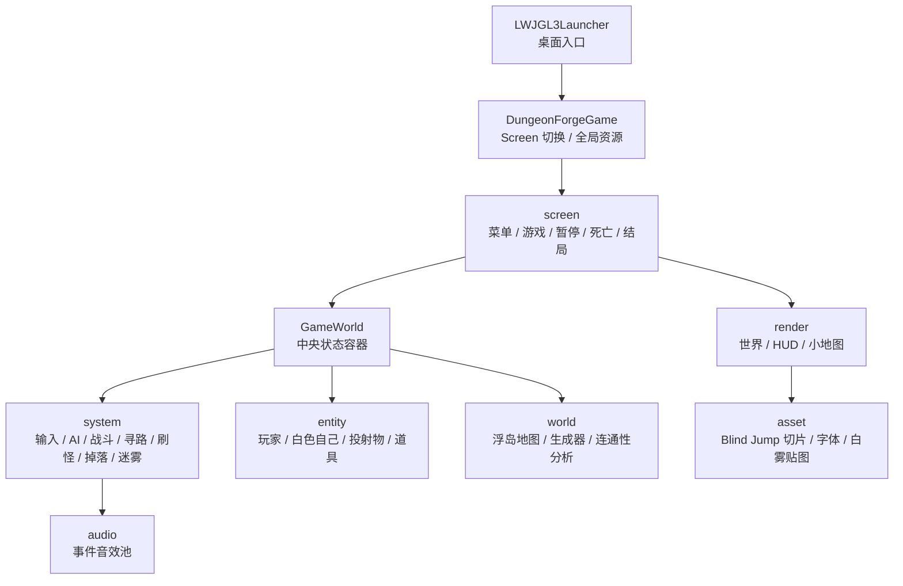
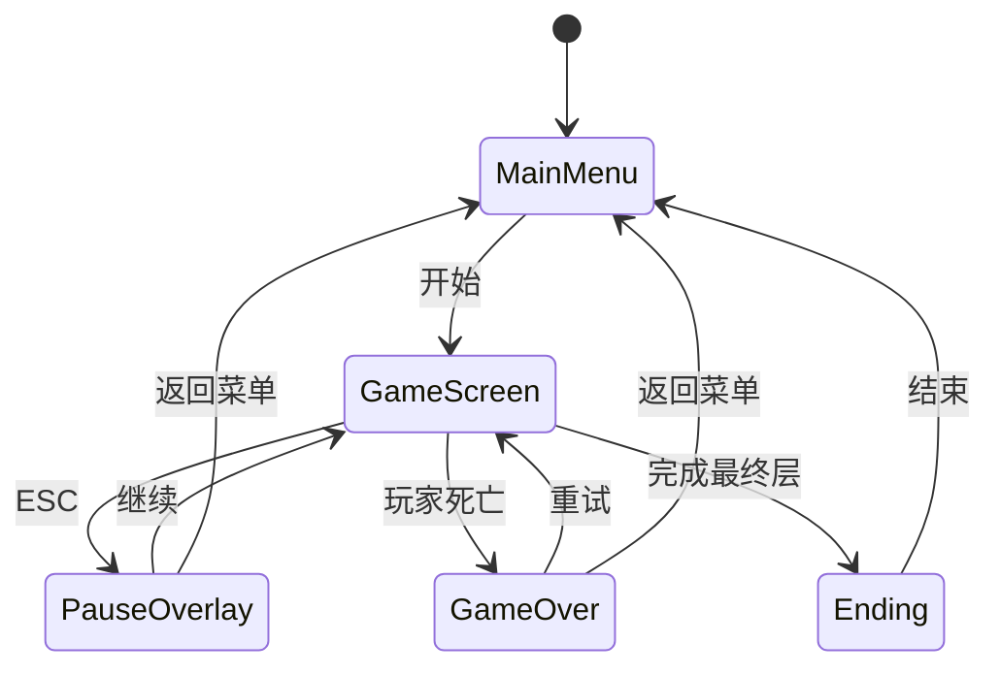
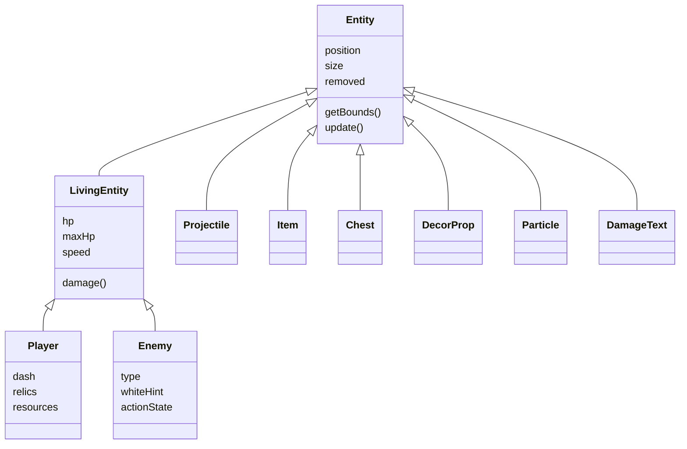
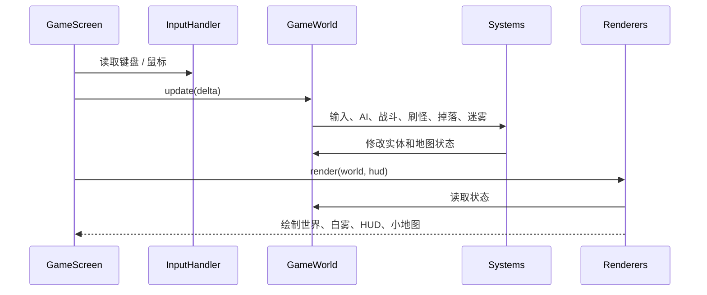

# Sky Spy（空谍）

<p align="center">
  
</p>

<p align="center">
  
  
  
  
</p>

`Sky Spy（空谍）` 是一个基于 **Java + libGDX** 的 2D 实时动作 Roguelite。玩家在白雾浮岛中探索、射击、冲刺、击退敌人，并通过“记忆裂隙”向上层推进。

一句话介绍：

> 在白雾浮岛上，用眼部投射击落被漂白的“自己”，收集记忆碎片，逼近顶层真相。

剧情完整设定见 [SKY_SPY_STORY_PLAN.md](SKY_SPY_STORY_PLAN.md)，当前实现符合度见 [SKY_SPY_COMPLIANCE_AUDIT.md](SKY_SPY_COMPLIANCE_AUDIT.md)。

## 项目亮点

| 亮点 | 说明 |
|---|---|
| 白雾浮岛替代传统地牢 | 场景不是封闭迷宫，而是可坠落的随机浮岛，视觉和玩法都贴合“空白记忆”设定。 |
| 边缘坠落变成战斗策略 | 击退不只是数值反馈，玩家可以主动把敌人打下平台。 |
| 随机生成仍可验证 | 使用 seed、连通性分析和合同测试，避免随机地图出现不可通关孤岛。 |
| 敌人叙事和素材统一 | 除白猫外，敌人与主角共用素材，通过白色遮罩、行为和层级变化表达“白色自己”。 |
| README 可直接用于答辩 | 首页负责讲解主线，算法细节放入 `docs/ALGORITHMS.md`，GIF 位置已预留。 |

## 答辩讲解路线

这份 README 可以直接作为讲解稿使用，推荐顺序：

1. **项目定位**：不是传统地牢，而是白雾浮岛 Roguelite。
2. **核心玩法**：随机浮岛、边缘坠落、眼部投射、击退敌人。
3. **技术栈**：Java 17、libGDX、LWJGL3、Gradle、FreeType。
4. **关键算法**：Delaunay 候选图、MST 连通、A* 寻路、白雾视野。
5. **系统实现**：Screen、World、Entity、System、Renderer 分层。
6. **实现成果**：地图可达、敌人追踪、击退坠落、白雾视野、结局流程。
7. **验证方式**：编译、测试、地图连通性合同测试、运行展示 GIF。
8. **局限与展望**：说明当前不足和下一步可做内容。

## 玩法展示（待录制 GIF）

> 下面先保留稳定路径。录制完成后，把同名 GIF 放进 `docs/media/` 即可显示。

| 展示点 | 说明 | GIF |
|---|---|---|
| 完整流程 | 从进入浮岛、探索、战斗、收集碎片到进入裂隙的完整短流程。 |  |
| 虚空坠落 | 玩家或敌人离开浮岛边缘会坠落死亡。 |  |
| 眼部投射 | 鼠标决定投射方向，子弹从角色眼部发出。 |  |
| 击落敌人 | 投射物带击退，可把白色自己打下平台。 |  |
| 记忆裂隙 | 收集记忆碎片后，在裂隙处按 `E` 进入下一层。 |  |
| 白雾视野 | 白雾遮住远处区域，视野外敌人信息不会显示。 |  |

## 功能模块与玩法

### 1. 白雾浮岛

每层地图由多个悬空平台和连接桥组成。地图不是固定关卡，而是每次生成不同结构。

关键体验：

- 平台边缘不是装饰，玩家和敌人离开可行走区域都会坠落。
- 通道宽度至少 2 格，减少卡死和误判。
- 关键节点包括出生点、记忆碎片、情绪匣和记忆裂隙。
- 小地图显示已探索区域和关键元素。

### 2. 眼部投射与击退

当前版本不绘制独立武器精灵，攻击表现为从角色眼部发出的投射物。

规则：

- 鼠标左键或右键射击。
- 射击方向由鼠标世界坐标决定。
- 投射物带击退。
- 敌人被击退到平台外会坠落死亡。
- 发射投射物不会强行打断移动动画。

### 3. 白色自己与白猫

敌人不是传统怪物，而是被漂白的自我片段。

- 除白猫外，敌人与主角共用同一套人形素材。
- 差异由白色 tint、透明度、行为、预警和层级变化体现。
- 越往上，敌人的白色遮罩越弱，越接近“我”。
- 白猫使用 Blind Jump 的 Laika 猫帧，是独立记忆锚点。

### 4. Roguelite 循环

单局流程：

1. 进入随机浮岛。
2. 探索白雾中的平台。
3. 收集记忆碎片、修补、回响和童年残留。
4. 击退或击败白色自己。
5. 打开记忆裂隙进入下一层。
6. 死亡后泄露记忆短句，并保留部分局外成长。

## 用到的库与工具

| 类别 | 技术 | 项目用途 |
|---|---|---|
| 语言 | Java 17 | 主体开发语言 |
| 游戏框架 | libGDX 1.14.0 | 游戏循环、输入、图形、音频、文件加载 |
| 桌面后端 | LWJGL3 | Windows/macOS/Linux 桌面启动 |
| 构建工具 | Gradle 9.1.0 wrapper | 编译、运行、测试、打包 |
| 字体扩展 | gdx-freetype | 加载中文字体并生成 BitmapFont |
| 测试 | JUnit 5 | 地图生成合同测试 |
| 资源 | Blind Jump assets | 角色、猫、浮岛地块、UI 视觉基础 |

说明：

- 项目不需要全局安装 Gradle，使用仓库内 wrapper。
- `assets/shaders/` 目前没有接入运行时代码，当前渲染仍以 `SpriteBatch`、`ShapeRenderer` 和程序生成贴图为主。
- 中文字体使用 [assets/fonts/SmileySans-Oblique-2.ttf](assets/fonts/SmileySans-Oblique-2.ttf)。

## 关键算法

更详细的算法说明见 [docs/ALGORITHMS.md](docs/ALGORITHMS.md)。

| 模块 | 算法 / 方法 | 解决的问题 |
|---|---|---|
| 地图生成 | Delaunay 风格候选边 | 让浮岛连接更自然，避免纯随机乱连 |
| 地图连通 | MST 最小生成树 | 保证所有关键浮岛可达 |
| 路线变化 | loop 边 | 增加绕路和重玩变化 |
| 通道生成 | 加权路径搜索 | 生成至少 2 格宽的连接桥 |
| 地图验证 | Flood fill / 连通性统计 | 避免小孤岛和不可通关地图 |
| 敌人寻路 | A* + 曼哈顿启发 | 敌人绕路追踪玩家 |
| 边缘控制 | edge exposure cost | 降低敌人主动走下平台的概率 |
| 视野系统 | 距离渐变白雾 | 让未知区域符合“白色空白”设定 |

算法总流程：


## 项目结构

项目按“界面层、世界状态、逻辑系统、渲染层、资源层”拆分。`core` 中是平台无关逻辑，`lwjgl3` 只负责桌面启动和打包。

### 代码分层图



这张图回答“代码为什么分层”：`GameWorld` 保存状态，`system` 修改状态，`render` 只读取状态并绘制。

### Screen 切换关系



暂停界面是覆盖层，不销毁当前 `GameWorld`；死亡和结局界面会保留刚结束的游戏画面作为背景，便于统一视觉风格。

### 实体继承关系



继承关系保持简单：会受伤、有生命值的对象继承 `LivingEntity`；投射物、粒子、文字和道具只继承基础 `Entity`。

### 单帧更新流程



这张图用于说明 `update` 和 `render` 的边界：逻辑系统负责改变世界，渲染器负责展示世界。

```text
java_end_work/
├── core/                                      # 全部游戏逻辑，平台无关，61 个 Java 文件
│   └── src/main/java/com/kayro/dungeon/
│       ├── DungeonForgeGame.java              # 游戏主类，继承 Game，统一切换 Screen
│       ├── screen/                            # 界面层
│       │   ├── BaseMenuScreen.java            # 菜单类公共底层：白雾遮罩、按钮、字体
│       │   ├── MainMenuScreen.java            # 主菜单
│       │   ├── GameScreen.java                # 游戏主界面，持有 GameWorld
│       │   ├── PauseMenuOverlay.java          # 暂停覆盖层
│       │   ├── GameOverScreen.java            # 死亡结算
│       │   └── EndingScreen.java              # 结局界面
│       ├── world/                             # 世界与地图
│       │   ├── GameWorld.java                 # 中央状态容器，编排每帧系统
│       │   ├── DungeonGenerator.java          # 白雾浮岛生成：Delaunay + MST + 宽通道
│       │   ├── DungeonMap.java / Tile.java    # 地图、瓦片、世界坐标与 tile 坐标转换
│       │   ├── DungeonMapAnalyzer.java        # 地图连通性统计，服务自动化测试
│       │   ├── Room.java                      # 浮岛节点/房间锚点
│       │   ├── TileType.java                  # 可走地块、裂隙等 tile 类型
│       │   └── BiomeType.java                 # 层级视觉/环境类型保留枚举
│       ├── entity/                            # 实体与枚举
│       │   ├── Entity.java → LivingEntity.java # 实体继承根
│       │   ├── Player.java / Enemy.java       # 玩家 / 白色自己
│       │   ├── Projectile.java                # 眼部投射物
│       │   ├── Chest.java / Shop.java         # 情绪匣 / 回响交换
│       │   ├── Item.java / RelicType.java     # 修补、回响、童年残留
│       │   ├── DecorProp.java / PropType.java # 有语义的记忆道具
│       │   ├── Particle.java / DamageText.java # 粒子与反馈文本
│       │   ├── StoryBossKind.java             # 剧情 Boss 阶段
│       │   └── EnemyType / WeaponType / ItemType 等枚举
│       ├── system/                            # 逻辑系统层
│       │   ├── InputHandler.java              # 输入处理与鼠标世界坐标
│       │   ├── CameraController.java          # 摄像头平滑跟随
│       │   ├── AISystem.java                  # 敌人状态机和 Boss 行为
│       │   ├── PathfindingSystem.java         # A* 寻路 + 边缘风险代价
│       │   ├── CombatSystem.java              # 投射物、伤害、击退、白壳裂开
│       │   ├── FogOfWarSystem.java            # 探索状态与白雾视野数据
│       │   ├── SpawnerSystem.java             # 敌人与剧情层级刷怪
│       │   ├── LootSystem.java                # 掉落、资源、击落奖励
│       │   └── LevelSystem.java               # 层级/成长相关逻辑
│       ├── render/                            # 渲染层，只负责绘制
│       │   ├── WorldRenderer.java             # 浮岛、实体、白雾、投射物
│       │   ├── HudRenderer.java               # HUD、提示、资源状态
│       │   ├── MinimapRenderer.java           # 小地图
│       │   └── DebugRenderer.java             # 调试绘制
│       ├── asset/                             # 资源加载与动画
│       │   ├── GameAssets.java                # Blind Jump 素材切片、标题、字体、白雾贴图
│       │   ├── Assets.java                    # 资源生命周期封装
│       │   └── SpriteAnimations / FrameAnimationSet 等动画辅助
│       ├── audio/Sfx.java                     # 随机化音效池
│       └── util/                              # Constants / Direction / GameMath / Difficulty
├── lwjgl3/                                    # Desktop 启动器
│   └── src/main/java/com/kayro/dungeon/lwjgl3/
│       ├── Lwjgl3Launcher.java                # 桌面入口 main
│       └── StartupHelper.java                 # macOS -XstartOnFirstThread 重启逻辑
├── assets/                                    # 运行时贴图、字体、音效、许可证
├── docs/                                      # 答辩扩展文档和 GIF 占位
│   ├── ALGORITHMS.md                          # 算法流程图、伪代码、测试说明
│   └── media/                                 # README 演示 GIF
├── build.gradle / settings.gradle             # Gradle 构建配置
├── gradlew / gradlew.bat                      # Gradle wrapper
├── SKYSPY_FULL_PLAN.md                        # 当前完整设计方案
├── SKY_SPY_STORY_PLAN.md                      # 剧情与层级设定
├── SKY_SPY_COMPLIANCE_AUDIT.md                # 实现符合度审计
└── README.md                                  # 答辩主线文档
```

几个核心类：

| 类 | 作用 |
|---|---|
| `DungeonGenerator` | 生成白雾浮岛地图，保证连通和关键点可达 |
| `DungeonMapAnalyzer` | 统计地图连通性，服务自动化测试 |
| `PathfindingSystem` | A* 寻路，给敌人提供下一步目标 |
| `CombatSystem` | 玩家投射、敌人伤害、击退和命中反馈 |
| `AISystem` | 敌人追击、远程、冲锋、重击、Boss 行为 |
| `WorldRenderer` | 世界绘制、白雾、角色、敌人、投射物 |
| `HudRenderer` | 生命、资源、提示、小地图等 UI |
| `GameAssets` | Blind Jump 素材切片、字体、程序贴图 |

> 包名和部分类名仍保留 `DungeonForge`，这是为了避免无意义的大规模重命名；玩家可见标题、菜单、README 和计划文档都已统一到 `Sky Spy`。

## 实现成果与验收

| 验收点 | 当前状态 | 说明 |
|---|---|---|
| 随机浮岛地图 | 已实现 | 每层生成不同浮岛结构，保留 Roguelite 随机性。 |
| 主连通保证 | 已实现 | MST + 连通性分析，避免关键区域不可达。 |
| 宽通道 | 已实现 | 主通道至少 2 格，减少移动误判。 |
| A* 敌人追踪 | 已实现 | 敌人可绕路追踪，并通过边缘代价降低自杀概率。 |
| 虚空坠落 | 已实现 | 玩家坠落死亡，敌人坠落计入击落反馈。 |
| 眼部投射 | 已实现 | 鼠标方向控制投射物，不绘制独立武器精灵。 |
| 白雾视野 | 已实现 | 视野外敌人本体、血条、轮廓和预警不显示。 |
| 菜单 / 暂停 / 死亡 / 结局 | 已实现 | 使用统一白雾遮罩和中文字体。 |
| 地图合同测试 | 已实现 | 覆盖相同 seed 稳定性、出口可达和孤岛检测。 |

答辩时可以把这一节当作“项目不是只停留在设想，而是已经跑通的功能清单”。

## 视觉与 UI

视觉方向：

- 白雾、浅蓝、低饱和浮岛，符合“空白天堂 / 记忆空间”。
- 主菜单使用 [assets/title.png](assets/title.png)。
- 菜单、暂停、死亡、结局界面使用统一的白雾遮罩风格。
- HUD 尽量减少背景块，避免遮挡画面。
- 视野外敌人的血条、轮廓、预警信息不显示。

资源原则：

- 正确使用现有素材优先。
- 没有语义合适的素材时，宁可不放，也不把无关素材硬改用途。
- 所有地图可见道具应有交互或清晰功能。

## 剧情概览

剧情只在 README 中简述，详细文本见 [SKY_SPY_STORY_PLAN.md](SKY_SPY_STORY_PLAN.md)。

主角醒在白雾浮岛，周围出现很多与自己相似的白色人形。它们阻止主角上升。主角一开始并不知道真相，只是在首次脱困后听见顶层传来的“别上来”，于是产生逆反冲动，一层层向上。

玩家后期会发现：这些敌人不是外部怪物，而是被漂白的自我片段。最终目标不是“杀光怪物”，而是穿过自我防御，重新看见完整的自己。

## 答辩演示脚本

如果不做 PPT，可以按下面顺序直接滚动 README 讲。

| 时间 | 讲什么 | 对应位置 |
|---|---|---|
| 0:00-1:00 | 项目是什么：白雾浮岛 Roguelite，不是传统地牢。 | 标题、项目亮点 |
| 1:00-2:30 | 核心玩法：探索、射击、击退、坠落、裂隙进入下一层。 | 玩法展示、功能模块 |
| 2:30-4:30 | 技术栈和工程结构：Java/libGDX、Screen、World、System、Renderer。 | 用到的库、项目结构 |
| 4:30-7:00 | 关键算法：Delaunay 候选边、MST、A*、白雾视野。 | 关键算法、`docs/ALGORITHMS.md` |
| 7:00-8:30 | 展示运行：录制 GIF 或现场运行 `lwjgl3:run`。 | 玩法展示、运行与验证 |
| 8:30-10:00 | 总结成果、局限和下一步。 | 实现成果、FAQ、局限与后续 |

建议现场优先展示 3 个 GIF：完整流程、虚空坠落、击落敌人。它们最能解释这个项目和普通地牢游戏的差异。

## 运行与验证

### Windows 运行

```powershell
.\gradlew.bat lwjgl3:run
```

### macOS / Linux 运行

```bash
chmod +x gradlew
./gradlew lwjgl3:run
```

### 编译

```powershell
.\gradlew.bat clean lwjgl3:classes core:classes
```

### 测试

```powershell
.\gradlew.bat core:test
```

当前地图生成测试覆盖：

- 同一 seed 生成相同地图签名。
- 代表性 seed 不生成不可达出口。
- 可行走区域不存在断开的孤岛。
- 地图可行走区域数量达到下限。

### 打包

```powershell
.\gradlew.bat lwjgl3:buildExe
```

打包流程会把 `assets/` 复制到产物目录，避免运行时缺资源。

## 操作方式

```text
WASD          移动
Shift         冲刺
鼠标左/右键   眼部投射
Q             使用修补
E             交互 / 打开情绪匣 / 进入裂隙
ESC           暂停
R             死亡后重试
Enter         菜单确认
```

如果系统中文输入法完全吞掉物理按键，游戏无法从 libGDX 收到这些按键事件；需要切回英文输入状态或使用鼠标操作。

## FAQ

**Q：为什么不继续做传统地牢？**  
A：当前设定是白雾、浮岛和“白色自己”。如果继续用传统墙体地牢，视觉和剧情会冲突，边缘坠落这类核心机制也很难成立。

**Q：为什么不用独立武器精灵？**  
A：现有素材中独立武器和人物动画很难在各方向完全自然对齐。当前改为眼部投射，既减少错位，也更贴合“空白自我”的设定。

**Q：为什么地图生成要用 Delaunay + MST？**  
A：Delaunay 风格候选边让岛屿连接更自然，MST 保证关键点连通，loop 边负责增加路线变化。

**Q：为什么还保留 A*？**  
A：敌人需要绕路追踪玩家，直线追踪会卡在平台边缘和连接桥附近。A* 加边缘代价能同时保证追踪和安全性。

**Q：为什么白雾不用传统墙体视线遮挡？**  
A：当前地图没有传统墙体，白雾表达的是“距离越远越空白”，所以距离渐变比递归遮挡更符合玩法和叙事。

## 局限与后续工作

| 当前局限 | 后续方向 |
|---|---|
| GIF 尚未录制 | 按 `docs/media/README.md` 中的文件名补齐演示素材。 |
| 部分类名仍保留历史命名 | 如需发布正式版，再统一重命名包名和主类。 |
| Boss 演出仍偏简化 | 后续可补更明确的阶段动画和记忆验证 UI。 |
| Build 深度仍可扩展 | 增加更多童年残留，让不同局的投射、冲刺、击退风格差异更明显。 |
| UI 仍依赖运行时视觉检查 | 每次大改菜单和 HUD 后，需要做一轮实际窗口截图检查。 |

## 文档索引

| 文档 | 用途 |
|---|---|
| [README.md](README.md) | 答辩主线、项目概览、运行方式 |
| [docs/ALGORITHMS.md](docs/ALGORITHMS.md) | 地图、寻路、迷雾和测试算法说明 |
| [SKYSPY_FULL_PLAN.md](SKYSPY_FULL_PLAN.md) | 当前完整开发方案 |
| [SKY_SPY_STORY_PLAN.md](SKY_SPY_STORY_PLAN.md) | 剧情、层级、结局和回顾模式设定 |
| [SKY_SPY_COMPLIANCE_AUDIT.md](SKY_SPY_COMPLIANCE_AUDIT.md) | 实现与设定的符合度审计 |
| [docs/media/README.md](docs/media/README.md) | README 演示 GIF 文件名约定 |

## 资源与许可证

- 运行时素材主要来自 Blind Jump 资源集，已迁移到 `assets/`。
- 相关许可证文件保留在 `assets/` 和 `assets/skyspy/licenses/`。
- 字体、图片、音频和第三方素材应按许可证保留来源说明。
