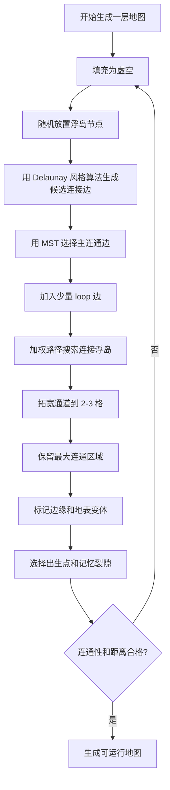
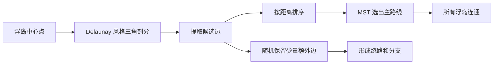
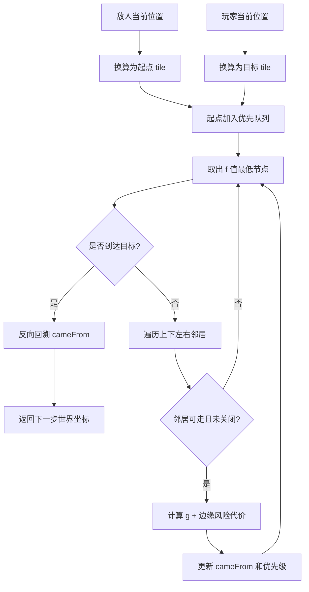
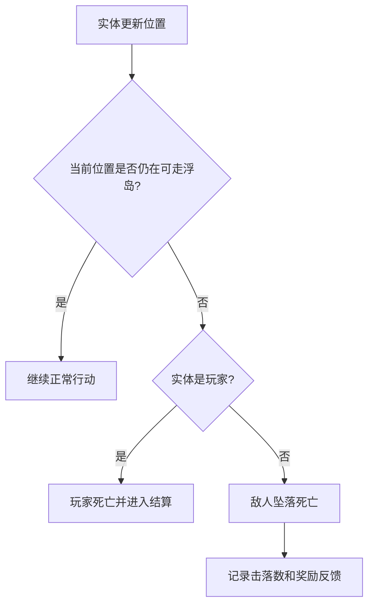
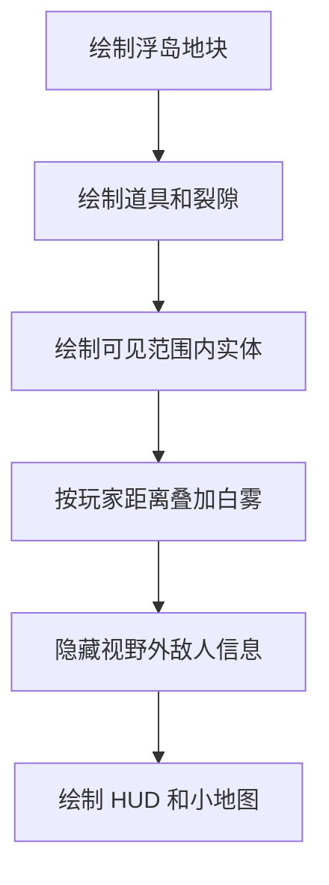
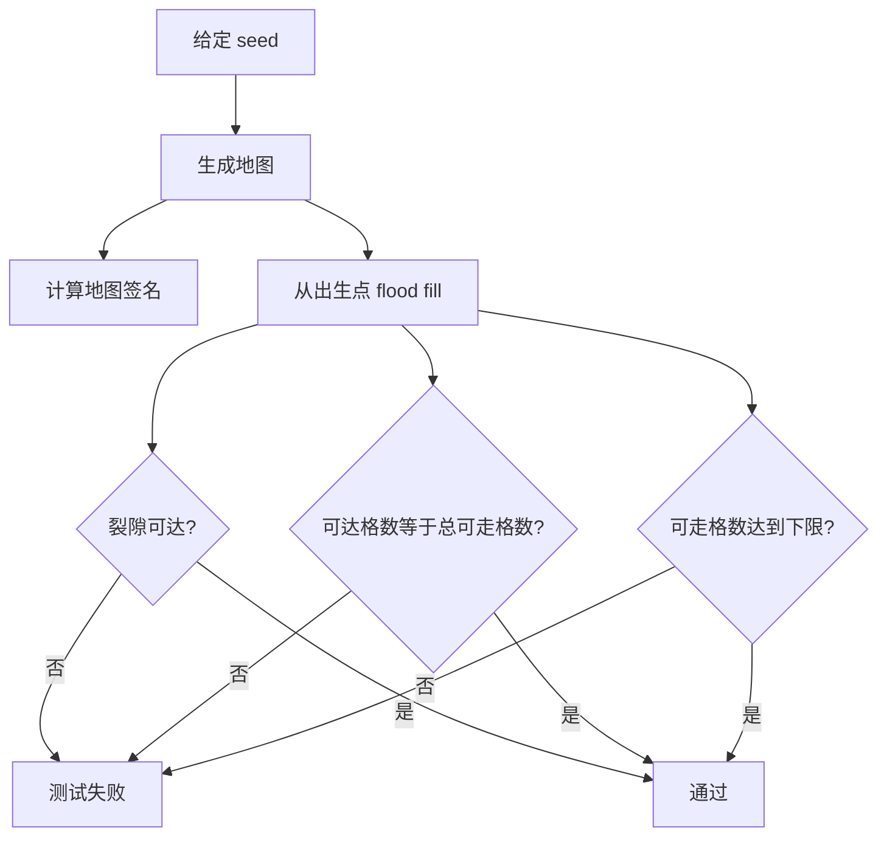

# Sky Spy 算法说明

这份文档补充 README 中的算法部分，重点说明“为什么地图可通、敌人能追、白雾合理”。

## 1. 浮岛地图生成

核心类：

- `core/src/main/java/com/kayro/dungeon/world/DungeonGenerator.java`
- `core/src/main/java/com/kayro/dungeon/world/DungeonMapAnalyzer.java`
- `core/src/test/java/com/kayro/dungeon/world/DungeonGeneratorContractTest.java`

目标：

- 生成随机浮岛，而不是传统封闭房间。
- 保证出生点、记忆碎片和记忆裂隙可达。
- 避免无法通关的小孤岛。
- 通道至少 2 格宽，减少移动误判。

整体流程图：



生成流程：

1. **生成浮岛节点**  
   在地图范围内放置多个矩形/岛屿节点，作为主要平台。

2. **构造候选连接边**  
   使用 Delaunay 风格三角剖分，从所有岛屿中心生成一批自然连接边。这样比“随机任意连接两个房间”更稳定，边不会过度交叉。

3. **MST 保证主连通**  
   对候选边按距离排序，用最小生成树思想选边，保证所有关键岛屿至少被一棵连通树连接起来。

4. **增加 loop 边**  
   在主连通树之外，随机保留少量额外边，给地图增加绕路和重玩差异。

5. **加权路径连接岛屿**  
   对每条连接边运行网格路径搜索，生成桥和走廊。路径不是简单直线，而是会考虑地图已有结构和边缘代价。

6. **拓宽通道和修边**  
   主通道拓宽到 2 或 3 格，再根据邻接关系标记浮岛边缘瓦片，让画面有厚度。

7. **连通性验证**  
   生成后用 flood fill 检查可行走区域，确认裂隙可达，并过滤断开的可行走孤岛。

核心伪代码：

```java
DungeonMap generate() {
    for (int attempt = 0; attempt < MAX_GENERATION_ATTEMPTS; attempt++) {
        fillVisualMapWithVoid();
        placeGraphRooms();                         // 浮岛节点
        for (GraphEdge edge : connectedRoomGraph()) {
            carvePathCorridor(edge.from, edge.to); // 加权路径生成连接桥
        }
        keepLargestComponent();
        widenThinWalkways();
        addEdgesAndSurfaceVariants();

        spawn = chooseCenterishWalkableTile();
        rift = chooseFarWalkableTile(spawn);
        if (validCandidate(spawn, rift)) {
            return buildDungeonMap(spawn, rift);
        }
    }
    return buildBestFallbackMap();
}
```

## 2. Delaunay + MST 的作用

如果只随机连接房间，会出现两个问题：

- 连接线过乱，地图像噪声。
- 有些岛屿可能距离太远，桥很长或很不自然。

当前方案先用 Delaunay 风格候选边生成“比较合理的邻居关系”，再用 MST 保证连通。效果是：

- 地图结构更像自然浮岛群。
- 主路线一定能走通。
- 加 loop 边后仍有分支和探索感。

简要说明：

> Delaunay 负责“谁适合连谁”，MST 负责“所有关键点必须连起来”，loop 边负责“每局不要只有一条死路线”。

关系图：



简化代码逻辑：

```java
ArrayList<GraphEdge> edges = delaunayEdges();
edges.sort(byDistance);

for (GraphEdge edge : edges) {
    if (connectsDifferentComponents(edge)) {
        selected.add(edge);     // MST 主连通边
        union(edge.a, edge.b);
    } else if (randomChance(LOOP_EDGE_CHANCE)) {
        selected.add(edge);     // loop 边，增加路线变化
    }
}
```

这里的重点不是展示数学公式，而是说明设计目的：先建立自然邻接关系，再保证可通关。

## 3. A* 敌人寻路

核心类：

- `core/src/main/java/com/kayro/dungeon/system/PathfindingSystem.java`

敌人寻路使用 A*：

- 节点：地图 tile。
- 四方向移动。
- 启发函数：曼哈顿距离。
- `PriorityQueue` 保存 open set。
- `cameFrom` 记录路径来源。
- 每次只返回下一步目标，避免敌人每帧持有整条路径。

额外处理：

- 情绪匣等阻挡物会被视作不可走。
- 通过 `edgeExposureCost` 提高平台边缘格子的代价。
- 敌人会倾向走更安全的内侧路线，减少自己走下平台的情况。

核心说明：

> A* 负责“能追上玩家”，边缘代价负责“不要自己冲进虚空”。

A* 流程图：



关键代码片段：

```java
float tentative = getGScore(current.index)
        + 1f
        + edgeExposureCost(world, nextX, nextY);

float priority = tentative + heuristic(nextX, nextY, goalX, goalY);
open.add(new Node(next, priority));
```

边缘风险代价：

```java
private float edgeExposureCost(GameWorld world, int x, int y) {
    int exposedSides = 0;
    for (int i = 0; i < 4; i++) {
        if (!world.map.isWalkableTile(x + DIR_X[i], y + DIR_Y[i])) {
            exposedSides++;
        }
    }
    return exposedSides * 0.75f;
}
```

这个代价让靠近虚空边缘的 tile 变“贵”，敌人仍能追人，但更倾向走内侧。

## 4. 虚空坠落判定

核心目标是把浮岛边缘做成玩法，而不是背景。

规则：

- 实体中心或碰撞区域离开可行走 tile 后，会进入坠落死亡逻辑。
- 玩家坠落直接结束本局。
- 敌人坠落算作击落，给予反馈和奖励。
- 子弹不再因传统墙体消失，因为当前场景没有封闭墙体。

这让“击退”从普通数值效果变成了战术目标。

判定流程：



可以这样讲：

```java
if (!map.isWalkableWorld(entity.getCenter())) {
    if (entity == player) {
        killPlayerByVoid();
    } else {
        killEnemyByKnockoff(enemy);
    }
}
```

这部分把“地图边界”转成了战斗系统的一部分。

## 5. 白雾视野

白雾不是传统黑暗迷雾，而是剧情设定中的“空白记忆”。

实现目标：

- 玩家附近清晰。
- 距离越远越白。
- 视野外敌人的本体、轮廓、血条和预警都不显示。
- UI 绘制在雾层上方，保证信息可读。

当前方案使用距离渐变白雾，而不是递归视线遮挡。原因是当前地图没有传统墙体，遮挡重点不是“墙后不可见”，而是“距离越远越被白雾吞没”。

渲染流程：



白雾透明度可以概括为：

```java
float distance = playerCenter.dst(tileCenter);
float t = clamp((distance - clearRadius) / (fogRadius - clearRadius), 0f, 1f);
float fogAlpha = smoothstep(t) * maxFogAlpha;
```

白雾系统的重点是：

- 中心清晰，边缘变白。
- 视野外不仅看不清地图，也看不到敌人 UI。
- 这和剧情里的“记忆被漂白”一致。

## 6. 地图生成合同测试

核心测试：

- `sameSeedProducesSameMapSignature`
- `representativeSeedsProduceReachableFloatingIslands`

验证内容：

- 同一个 seed 生成结果稳定。
- 代表性 seed 下，出口可达。
- 可行走区域没有断开的孤岛。
- 可行走 tile 数量达到最低要求。

这类测试不是验证“地图好看”，而是保证生成器不会产出基础不可玩地图。

测试逻辑示意：



合同测试片段：

```java
for (long seed = 1L; seed <= 40L; seed++) {
    DungeonMap map = new DungeonGenerator(seed).generate();
    int walkable = DungeonMapAnalyzer.walkableCount(map);

    assertTrue(walkable >= 900);
    assertTrue(DungeonMapAnalyzer.exitReachable(map));
    assertEquals(walkable, DungeonMapAnalyzer.reachableWalkableCount(map));
}
```

运行：

```powershell
.\gradlew.bat core:test
```

## 7. 可讲的技术取舍

| 问题 | 取舍 |
|---|---|
| 为什么不用纯手工地图 | Roguelite 需要重开变化，随机生成更符合目标 |
| 为什么不用传统地牢房间 | 项目设定是白雾浮岛，传统地牢会和美术/剧情冲突 |
| 为什么保留 A* | 敌人需要绕路追踪，不能只直线冲玩家 |
| 为什么白雾不用墙体遮挡 | 当前没有传统墙，距离渐变更符合“空白记忆” |
| 为什么要合同测试 | 随机地图最怕偶发坏图，seed 测试能稳定复现问题 |
